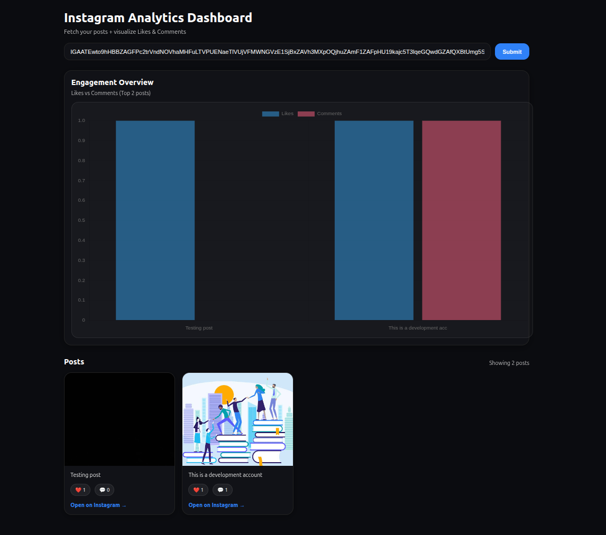

# Instagram Analytics Dashboard

A simple and powerful platform to track Instagram engagement metrics and visualize your social media performance.



## Overview

This application helps you analyze Instagram posts with real-time engagement tracking. View likes, comments, and detailed analytics all in one place. Features a simple CRUD backend for managing product data with a modern React frontend.

## Key Features

- **Engagement Overview** - Track likes and comments across your posts
- **Post Analytics** - Detailed metrics for each Instagram post
- **Easy Navigation** - Simple and clean user interface
- **Simple CRUD Backend** - Create, read, update, and delete products with ease

## Tech Stack

- **Backend** - FastAPI with Python
- **Frontend** - React with Vite
- **Database** - PostgreSQL with SQLAlchemy
- **Charts** - Chart.js for data visualization

## Getting Started

### Prerequisites

- Python 3.11+
- Node.js 18+
- PostgreSQL

### Installation

1. **Install Backend Dependencies**

```bash
python -m venv venv
source venv/bin/activate
pip install fastapi uvicorn sqlalchemy psycopg2-binary
```

2. **Install Frontend Dependencies**

```bash
cd frontend
npm install
```

3. **Start the Backend**

```bash
uvicorn main:app --reload
```

4. **Start the Frontend**

```bash
cd frontend
npm run dev
```

### Endpoints

**CRUD Operations:**

- `GET /` - Health check
- `GET /allProducts` - Retrieve all products
- `POST /addProduct` - Create a new product
- `POST /product/{id}` - Get product by ID
- `PUT /update/{id}` - Update an existing product
- `DELETE /delete/{id}` - Delete a product

### Notes

- Database tables auto-create at startup
- `id` is auto-incremented by the database
- Only send `name`, `desc`, and `price` in requests
